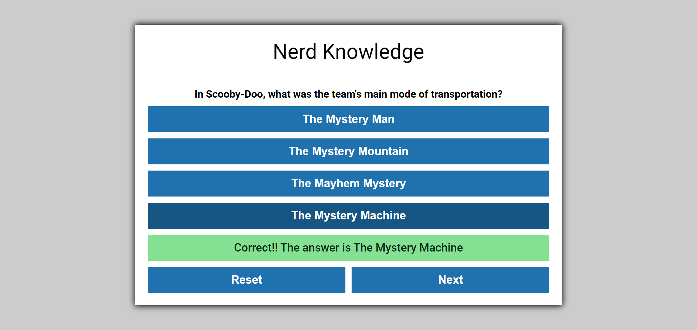

# Project 12 - Quiz App
I tried to make this as miniscule to the project requirements as possible due to time constraints. I have a hard time only doing what's asked of me and not more. This is my attempt at doing just what's asked. No score or name is kept. 

## To Do (Completed)
- [x] Basic frame work
- [x] jQuery integration
- [x] Start Button works
- [x] Random question is generated
- [x] Question populates where it's supposed to
- [x] Correct Answer populates where it's supposed to
- [x] Fix buttons to only display one item from array of answers
- [x] Add listener on button clicks
- [x] Add logic to button clicks to style and display correct Answer
- [x] Add next button after answered
- [x] Create end for quiz
